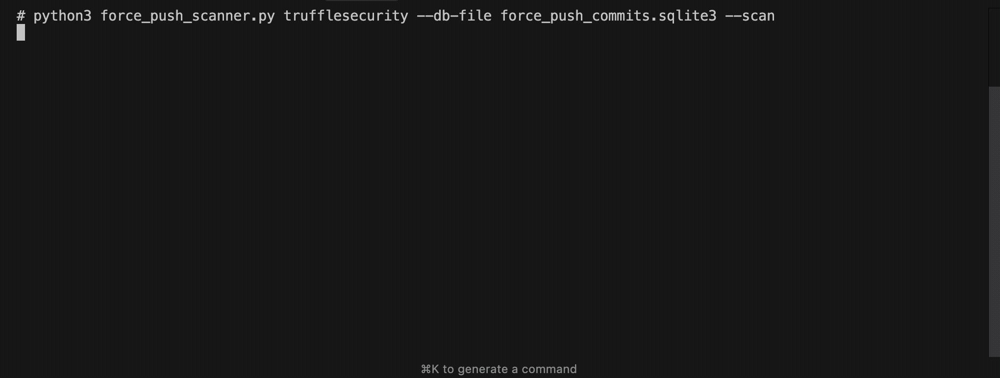

# Force Push Secret Scanner

This tool scans for secrets in dangling (dereferenced) commits on GitHub created by force push events. A [force push](https://git-scm.com/docs/git-push#Documentation/git-push.txt---force) occurs when developers overwrite commit history, which often contains mistakes, like hard-coded credentials. This project relies on archived force push event data in the [GHArchive](https://www.gharchive.org/) to identify the relevant commits. 



This project was created in collaboration with [Sharon Brizinov](https://github.com/SharonBrizinov). Please read Sharon's blog post to learn how he identified force push commits in the GH Archive dataset and made $25k in bounties.

## Quickstart (recommended)

1. Download the Force Push Commits SQLite DB (`force_push_commits.sqlite3`) via a quick Google Form submission: <https://forms.gle/344GbP6WrJ1fhW2A6>. This lets you search all force push commits for any user/org locally.

2. Install Python deps:

```bash
pip install -r requirements.txt
```
3. Scan an org/user for secrets:

```bash
python force_push_scanner.py <org> --db-file /path/to/force_push_commits.sqlite3 --scan
```

### Alternative Usage: BigQuery

If you prefer querying BigQuery yourself, you can use our public table based off the GHArchive dataset (queries are typically free with a Google account). 

```sql
SELECT *
FROM `external-truffle-security-gha.force_push_commits.pushes`
WHERE repo_org = '<ORG>';
```

Export the results as a CSV, then run the scanner:

```bash
python force_push_scanner.py <org> --events-file /path/to/force_push_commits.csv --scan
```

---

## What the script does

* Lists zero-commit **force-push events** for `<org>`.
* Prints stats for each repo.
* (Optional `--scan`) For every commit:
  * Identifies the overwritten commits.
  * Runs **TruffleHog** (`--only-verified`) on the overwritten commits.
  * Outputs verified findings with commit link.

---

## Command-line options (abridged)

Run `python force_push_scanner.py -h` for full help.

* `--db-file`     SQLite DB path (preferred)
* `--events-file` CSV export path (BigQuery)
* `--scan`        Enable TruffleHog scanning
* `--verbose`, `-v` Debug logging

---

## FAQs

#### What is a Force Push?

A force push occurs when developers force a change in the current commit's HEAD ref, effectively overwriting commit history. This action is often done when a developer accidentally commits data containing a mistake, like hard-coded credentials. For more details, see [Sharon's blog post](https://trufflehog.dev/blog/2025/06/25/force-push-commits/) and git's documentation on [force pushes](https://git-scm.com/docs/git-push#Documentation/git-push.txt---force).

#### What is the GHArchive?

The GH Archive is a public dataset of *all* public GitHub activity. It's a great resource for security researchers and developers to analyze and understand the security landscape of the GitHub ecosystem. It's publicly available on BigQuery, but querying the entire dataset is expensive ($170/query). We trimmed the GH Archive dataset to only include force push commits.

#### Why not host the Force Push Commits DB publicly?

We gate large downloads behind a form to deter abuse; the public BigQuery dataset remains open to all.

#### Dataset Updates

At the moment, the dataset (both SQLite3 & BigQuery versions) is static (with a last update of early June 2025). We're working on a solution to keep the dataset updated daily. When that happens, we'll update the README. Timeframe is estimated to be 1-2 weeks from public release of this tool.

---

**License:** provided *as-is*; we'll review PRs when time permits. We intend to update the DB on a monthly basis, but no guarantees.